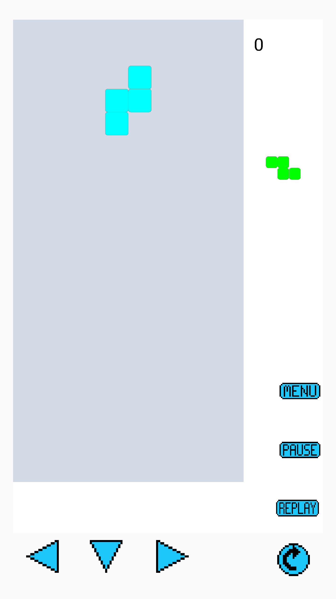
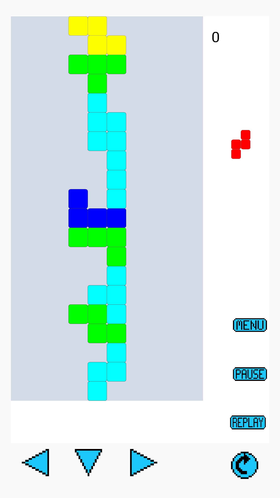
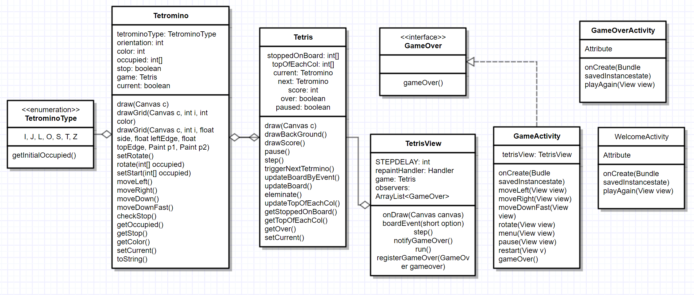

# Tetris

A simple Tetris game, Use Android to implentment.

  

Picture from [wikipeida](https://en.wikipedia.org/wiki/Tetris)

## Game summary
Screen shot of the game

* Welcome page

* Playing the game!

* Continue play

* Game over page

## UML Diagram

## Testing summary

Explain how to run the automated tests for this system

## Team meeting schedule
* Friday, Week 10
* Saturday,  Week 10
* Monday, Week 11
* Thursday, Week 11

## Statement of Originality

We declare that the work we have submitted for assignment one is entirely our own work, with the following documented exceptions:

* Uses an idea suggested by Stackoverfollow.
* Defination from Wikipedia

Signed: Wangchao Wei u6263937
Signed: Yilu Liu u6270742
Signed: JIawen He u6227591

## Authors

*  JiaWen He u6227591
*  Wangchao Wei u6263937
*  Yilu Liu u6270742

## Reference

* Wikipedia - [Tetris](https://en.wikipedia.org/wiki/Tetris)

