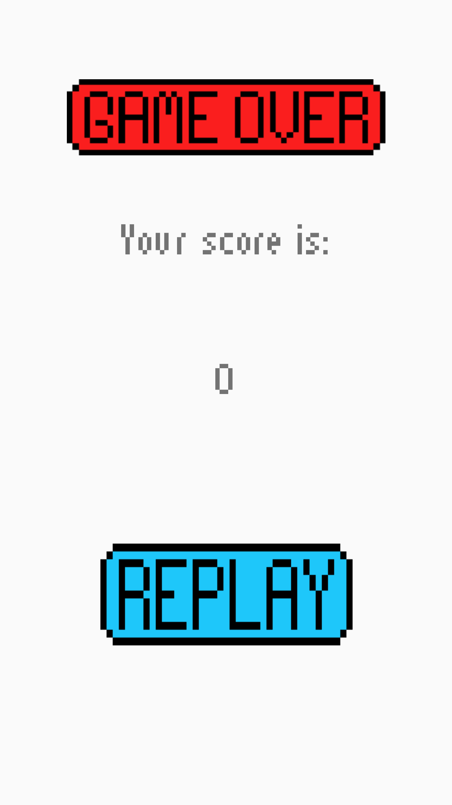

# Tetris

A simple Tetris game, Use Android to implentment.

## Game summary
Screen shot of the game

* Welcome page

* Playing the game!

* Continue play

* Game over page

The game have three main activities which is Welcome, Playing, and Gameover. By clicking the Play button, you are into the playing 
state, there are three buttons in the right you can click, which can be restart, pause or back to welcome page. And three control buttons in the bottom which can adjust
the movment or rotate the piece. The mark you gain will be recorded, and will show the final marks in the gameover activity page when the game is over.

## UML Diagram

## Testing summary
We mainly need testing for two classes: Tetromino and Tetris.

Tetromino class is mainly for encoding state of each piece of tetromino. The key methods in it is moving the Tetromino left, right, down and rotate. We tested them independently both in normal state and situations with obstructions. During testing, we actually found bug in rotating Tetromino of type I. When it is in left most or right most positions on board, it was likely to rotate into wrong positions. The bug is fixed now.

Tetris class contains all the information of occupied grids. So the most important function here is update board. We emphasized on testing this method in different situations and it successfully passed all tests.

## Design summary
Explain how to run the automated tests for this system

We mainly have four key issues to deal with during the design of Tetris game. They involves encoding Tetromino state, moving Tetromino, encoding Tetris game state and GUI drawing.

The first issue came to us is how to encode each Tetromino. For each piece, properties including four grids positions, orientation and color are saved in the program. We did this by creating a Tetromino class, with these attributes in it and several helper functions.

Then it comes to rotating, moving left and right, moving down the Tetromino. The idea is basically just add or subtract some value of positions. But it could be more complicated when the Tetromino is not abstract. When they are in a real game, obstructions can happen anywhere. This requires the information of the whole game state.

At this point, we need a Tetris class to encode game state. The Tetris class holds information of all stopped Tetromino and moving Tetromino. Stopped ones are not to be saved as Tetrominos, since some part of one Tetromino is possibly to be eliminated so grids are actually independent when stopped. An array is kept as an attribute in Tetris to represent all the stopped grids with their colors as element value. Once the currently moving Tetromino needs to stop, the array is updated and next Tetromino is triggered.

As for GUI drawing, they are throughout the whole project. We have draw methods in Tetromino, Tetris and TetrisView. The latter one calls the draw method of the former one and add some more features specifically in that case. One tricky point is how to adjust the layout. We tried to optimize this by setting both in java class file and xml files. Another tricky point is that we need to finish the previous activity when starting a new one.

## Team meeting schedule
* Friday, Week 10
* Saturday,  Week 10
* Monday, Week 11
* Thursday, Week 11

## Statement of Originality

We declare that the work we have submitted for assignment one is entirely our own work, with the following documented exceptions:

* Uses an idea suggested by Stackoverfollow.
* Defination from Wikipedia

Signed: Wangchao Wei u6263937
Signed: Yilu Liu u6270742
Signed: JIawen He u6227591

## Authors

*  JiaWen He u6227591
*  Wangchao Wei u6263937
*  Yilu Liu u6270742

## Reference

* Wikipedia - [Tetris](https://en.wikipedia.org/wiki/Tetris)

